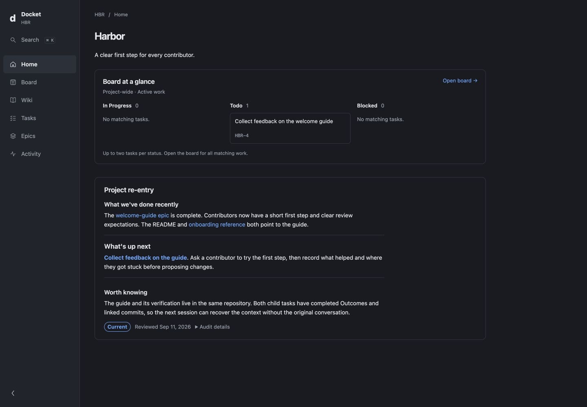

# GitDocket

GitDocket keeps project documentation and work tracking together as linked Markdown files in your repository, with a small CLI and local web interface for humans and coding agents.

It is for teams that want durable, reviewable project context without moving the source of truth into a hosted tracker. Files remain authoritative; GitDocket derives readiness, indexes, activity, and browser views from them.

> GitDocket 0.2.0 is a public preview. File formats and commands are tested, but the compatibility surface may still change as external use provides evidence.



## Requirements

- Bun 1.3.14 or newer
- macOS or Linux
- Git for task-linked history and commit integration

Windows has not yet passed the release gate and is not supported in the first preview.

## Install

Install the CLI and MCP server from npm with Bun:

```sh
bun add --global @gitdocket/cli @gitdocket/mcp
docket --version
```

The version command should report `0.2.0`. Both packages require Bun 1.3.14 or newer; the installed binaries remain `docket` and `docket-mcp`.

## Quickstart

From the repository you want to track:

```sh
docket init
docket overview
docket serve
```

`docket init` adds the bundle, workflow guidance, commit hook, generated index, and local cache without moving existing files. In a brownfield repository it lists Markdown files that still need a reviewed `type` field and leaves them untouched.

`docket serve` opens on `127.0.0.1` only. It is intended for the person using the same computer; it has no authentication or TLS and is not a LAN or hosted team server.

To install native guidance for a supported coding agent:

```sh
docket init --agent codex
docket init --agent claude
```

Once initialized, ask your agent to create and run a small “Welcome guide” epic:
write a short contributor guide, then link it from README, with concrete checks
for each task. Review the completed work, reconciled docs, and task-linked
receipt—or the concrete blocker. The [first-run walkthrough](docs/getting-started.md#3-try-a-small-epic-with-your-agent)
shows the expected result and how a later session recovers context.

## What is in a bundle?

A Docket bundle is one link graph containing documentation, decisions, tasks, epics, and agent workflows. Work state is ordinary frontmatter. Ready work is derived from `status: todo` plus completed dependencies; it is never another stored state.

The [basic example](examples/basic/) is a complete synthetic bundle. See [Getting started](docs/getting-started.md), [Concepts](docs/concepts.md), [CLI reference](docs/cli.md), [local-server safety](docs/serve.md), and [agent integration](docs/agents.md).

## Stability and upgrades

The first public release is a preview: file formats and commands are tested, but compatibility guarantees are intentionally narrow until real external use provides evidence. Vendored workflow files carry their originating GitDocket version; `docket upgrade` performs a three-way merge so local edits remain explicit.

## Telemetry

Telemetry is **local only and off by default**. Collection requires explicitly running `docket telemetry enable` for each checkout. Observations stay on your computer, outside your repository; GitDocket never uploads them. Run `docket telemetry disable` to stop collection or `docket telemetry delete` to remove the current checkout's enrollment and recorded data.

## Contributing and security

This public repository is release-fed from a private canonical development repository. Issues and feedback are welcome; source pull requests are not accepted during the first preview because an inbound synchronization workflow does not yet exist. Read [CONTRIBUTING.md](CONTRIBUTING.md) before opening an issue.

Please do not report vulnerabilities in a public issue. Use the repository’s private vulnerability-reporting form described in [SECURITY.md](SECURITY.md).

## License

Apache-2.0. See [LICENSE](LICENSE).
